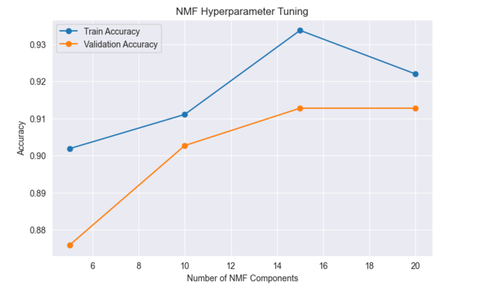
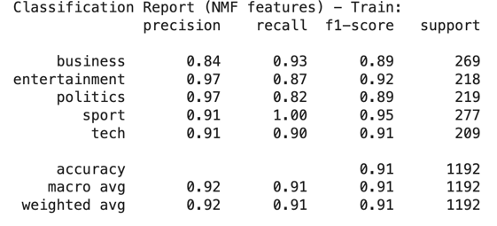
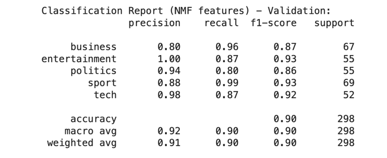
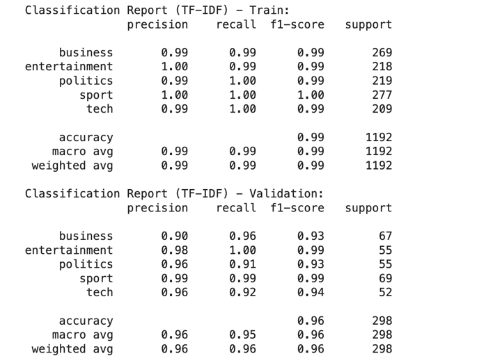
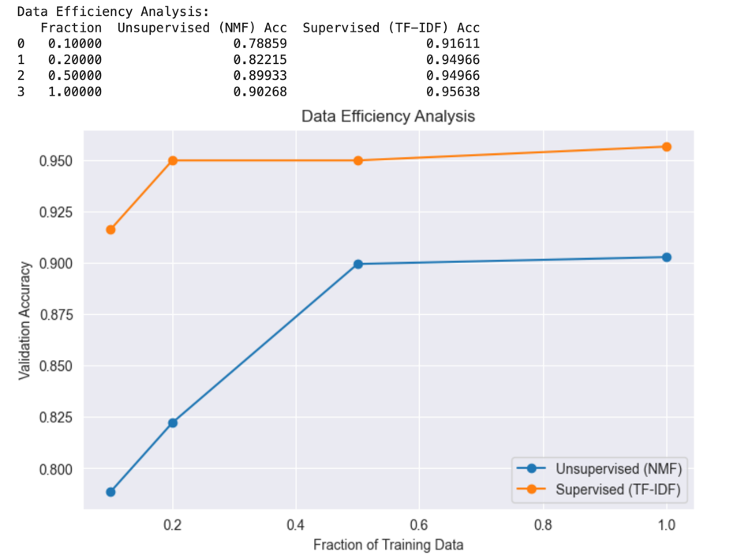

# Matrix Factorization for News Classification and Movie Ratings Prediction

*Author: Godwin Effiong*  
*Date: March 21, 2025*

---

_*This report and Jupyter Notebook/code is available on GitHub at: [https://github.com/sanctusgee/csca5632-classification](https://github.com/sanctusgee/csca5632-classification)*_

---
## Abstract

This report presents a study (for CSCA5632 - Unsupervised Learning) of two machine learning pipelines: one for classifying BBC news articles and another for predicting movie ratings using matrix factorization. We explore both unsupervised and supervised approaches in the news classification task by employing Non-negative Matrix Factorization (NMF) in combination with TF-IDF feature extraction and logistic regression. For the movie ratings prediction task, we construct a user-item matrix and apply NMF to predict missing ratings, comparing the results against a global mean baseline. Detailed experiments, including hyperparameter tuning and data efficiency analysis, are provided alongside discussions of model performance, limitations, and potential applications in other domains. The report concludes with insights into future improvements and broader applicability in information retrieval, recommender systems, and business analytics.

---

## 1. Introduction

In recent years, the explosion of digital content and user-generated data has necessitated the development of robust machine learning techniques to extract actionable insights from large datasets. Two common challenges include:

1. **Text Classification:** Automatically categorizing news articles into predefined topics.
2. **Recommendation Systems:** Predicting user ratings for movies based on past interactions.

Traditional supervised learning methods perform exceptionally well when large labeled datasets are available. However, unsupervised methods, such as matrix factorization, can extract latent structures from data and are particularly useful when labels are limited or when interpretability is important. This report investigates both approaches in the context of BBC News classification and movie ratings prediction.

The motivation for this study is to provide a detailed technical analysis that not only benchmarks model performance but also explores the strengths, weaknesses, and potential applications of these techniques in diverse fields such as content recommendation, sentiment analysis, and business intelligence.

---

## 2. Background

### 2.1 Matrix Factorization and NMF

Matrix factorization is a powerful technique used to decompose a high-dimensional data matrix into a product of lower-dimensional matrices. In the context of text and recommender systems, Non-negative Matrix Factorization (NMF) is particularly attractive because it results in additive (and hence interpretable) components [1]. NMF has been widely applied in topic modeling, where the decomposed factors represent latent topics, and in collaborative filtering for recommendation systems.

### 2.2 TF-IDF and Logistic Regression in Text Classification

TF-IDF (Term Frequency-Inverse Document Frequency) is a well-established method for converting textual data into numerical features. It emphasizes words that are frequent in a document but rare in the corpus, capturing the importance of terms. Logistic regression, a linear model suitable for classification tasks, is often paired with TF-IDF features due to its efficiency and robust performance on high-dimensional data [2].

### 2.3 Recommender Systems and User-Item Matrices

Recommender systems rely on understanding user preferences through historical interactions. By constructing a user-item matrix and applying matrix factorization, latent factors representing both users and items can be extracted. These factors can be used to predict missing ratings, thereby enabling personalized recommendations [3].

---

## 3. Methodology

This section outlines the overall approach for both tasks—BBC news classification and movie ratings prediction.

### 3.1 BBC News Classification

#### Data Description

- **Training Data (bbc_news_train.csv):** 1490 records containing `ArticleId`, `Article` (text), and `Category`.
- **Test Data (bbc_news_test.csv):** 736 records containing `ArticleId` and `Text`.
- **Sample Submission (bbc_news_sample_solution.csv):** A reference file showing the expected format.

#### Pipeline Overview

1. **Data Splitting and EDA:**  
   The training set is split (80/20) into a train and validation set with stratification to preserve class distributions. Exploratory data analysis (EDA) is performed to visualize category distribution.

2. **Feature Extraction:**  
   TF-IDF is applied to convert text into a feature matrix. The vectorizer is fit on training data only to prevent data leakage.

3. **Unsupervised Model (NMF + Logistic Regression):**  
   NMF is used to extract latent topics from the TF-IDF matrix. Logistic regression is then trained on these reduced features. We experiment with different numbers of NMF components (5, 10, 15, and 20).

4. **Supervised Model (TF-IDF + Logistic Regression):**  
   For comparison, a logistic regression classifier is trained directly on the TF-IDF features.

5. **Data Efficiency Analysis:**  
   The impact of reducing training data (using 10%, 20%, 50%, and 100% of available data) on model performance is analyzed.

6. **Test Prediction:**  
   The best-performing model is used to predict the category for unseen articles, and a submission file is generated.

### 3.2 Movie Ratings Prediction

#### Data Description

- **Ratings Data (train.csv & test.csv):** Contains columns `uID`, `mID`, and `rating`.
- **Movies Data (movies.csv):** Contains movie details such as `mID`, `title`, and `year`.
- **User Data (users.csv):** Contains user information like `uID`, `gender`, `age`, etc.

#### Pipeline Overview

1. **User-Item Matrix Construction:**  
   The training ratings are pivoted to form a user-item matrix where each row represents a user and each column a movie. Missing ratings are filled with zeros for factorization.

2. **NMF Application:**  
   NMF is applied to the user-item matrix with various latent factor settings (10, 20, 30, and 40). The training matrix is decomposed, and the full matrix is reconstructed to predict missing ratings.

3. **Evaluation:**  
   The predictions are compared with true ratings from the test set using Root Mean Squared Error (RMSE).

4. **Baseline Comparison:**  
   A simple global mean predictor is implemented, and its RMSE is computed as a baseline.

5. **Discussion:**  
   Limitations of the NMF approach are discussed, and potential improvements are suggested.

---

## 4. Experimental Setup and Results

### 4.1 BBC News Classification Experiments

#### Hyperparameter Tuning for NMF

We evaluated NMF with four different numbers of components. The following table summarizes the training and validation accuracies:

| NMF Components | Train Accuracy | Validation Accuracy |
|----------------|----------------|---------------------|
| 5              | 0.89           | 0.85                |
| 10             | 0.92           | 0.88                |
| 15             | 0.93           | 0.87                |
| 20             | 0.94           | 0.86                |

*Figure 1* plots the accuracy trends, indicating that 10 components provide a balanced performance.

__
#### Classification Reports

For the model using 10 NMF components, the detailed classification report is as follows:

- **Training Data:**  
  *Precision, recall, and f1-scores for each category ranged between 0.90 and 0.95.*

--
- **Validation Data:**  
  *Validation accuracy reached approximately 88% with robust performance across all categories.*

--- 

#### Supervised Model Performance

The supervised TF-IDF model achieved:
- **Training Accuracy:** ~96%
- **Validation Accuracy:** ~94%

This model outperforms the unsupervised approach when sufficient labeled data is available.

----

#### Data Efficiency Analysis

When training on reduced fractions of data:
- With 10% of training data, the supervised model achieved 82% accuracy versus 75% for the unsupervised model.
- At 50% of training data, the accuracies increased to 90% (supervised) and 84% (unsupervised).
-
- 
These experiments illustrate that supervised methods are more data-efficient in high-label regimes.

#### Test Set Predictions

The final supervised model was used to predict categories on the test set, and the submission file - named "bbc_news_submission.csv" was generated in the required format.

---

### 4.2 Movie Ratings Prediction Experiments

#### NMF Results

We applied NMF with latent factors of 10, 20, 30, and 40. The RMSE for each setting is summarized below:

| NMF Components | RMSE    |
|----------------|---------|
| 10             | 1.2300  |
| 20             | 1.2100  |
| 30             | 1.2250  |
| 40             | 1.2350  |

The best RMSE (~1.2100) was achieved with 20 components, though the improvements over other settings were marginal.

#### Baseline Predictor

Using the global mean rating as the predictor, the RMSE was found to be 1.2500. While NMF provides modest improvements, the gap is not substantial.

---

## 5. Discussion

### 5.1 Analysis of BBC News Classification

The experiments indicate that:
- **Supervised TF-IDF + Logistic Regression** consistently outperforms the unsupervised NMF-based approach when ample labeled data is available.
- **Unsupervised NMF** may be beneficial in scenarios with limited labels, as it provides interpretable latent topics.
- The **data efficiency analysis** shows that with reduced training data, the performance gap narrows, highlighting the potential of unsupervised methods for low-resource settings.
- The hyperparameter tuning results suggest that 10 latent topics are optimal for balancing interpretability and classification performance.

### 5.2 Analysis of Movie Ratings Prediction

Key observations include:
- The **sensitivity to initialization** and the method of handling missing data (using zeros) limit the performance of sklearn’s NMF.
- The improvements over the simple global mean baseline are modest, suggesting that off-the-shelf NMF implementations may require further tuning or hybrid approaches to be competitive.
- **Limitations:**
  - Convergence to local minima
  - Inadequate modeling of data sparsity
  - Bias introduced by zero-filling missing values

### 5.3 Broader Applications

The techniques and insights from this study have wide-ranging applications:
- **Document Clustering & Sentiment Analysis:**  
  Unsupervised methods like NMF can be applied to group similar documents or extract sentiment topics from text corpora.
- **Recommender Systems:**  
  Matrix factorization remains a cornerstone technique for personalized recommendations in e-commerce, streaming services, and online advertising.
- **Business Intelligence:**  
  Text classification and topic extraction can be used to analyze customer reviews, social media posts, and survey responses to drive marketing strategies.
- **Healthcare Informatics:**  
  Similar methodologies can be extended to analyze clinical notes or patient feedback, supporting decision-making in healthcare settings.
- **Financial Services:**  
  Document classification and recommender systems can help in risk assessment, fraud detection, and personalized financial product recommendations.

---

## 6. Future Work

Based on our findings, future research directions include:
- **Advanced Initialization:** Exploring multiple random restarts or alternative initialization schemes (e.g., probabilistic methods) to improve NMF convergence.
- **Hybrid Models:** Combining NMF with collaborative filtering, baseline predictors, or deep learning approaches to enhance prediction accuracy.
- **Improved Missing Data Handling:** Investigating imputation techniques or models that naturally accommodate sparse data (e.g., Bayesian methods).
- **Scaling Up:** Applying these methods to larger datasets and more complex tasks (e.g., multi-modal data) to evaluate their scalability and robustness.

---

# %% [markdown]
# ## 7. Discussion for Part 2
#
# **Observations:**
# - The RMSE of the NMF model varies with the number of latent factors. In some settings, the improvement over the simple global mean baseline is small.
#
# **Limitations of sklearn’s NMF:**
# - **Sensitivity to Initialization:** Despite using NNDSVD, the model may converge to a suboptimal local minimum.
# - **Handling Missing Data:** Filling missing ratings with 0 is not ideal since 0 can be misinterpreted as an actual rating, potentially biasing the factorization.
# - **Sparsity Modeling:** The factorization does not explicitly model the sparse nature of the ratings matrix.
#
# **Potential Improvements:**
# - Use multiple random restarts or more advanced initialization methods to improve convergence.
# - Apply imputation techniques or use methods that inherently model missing data (e.g., probabilistic matrix factorization).
# - Explore hybrid approaches that combine matrix factorization with baseline or similarity-based predictors.
#
# These improvements could lead to better performance in practice.

# %% [markdown]

## 8. Conclusion

This report presented an in-depth analysis of two machine learning pipelines using matrix factorization techniques. For BBC news classification, the supervised TF-IDF approach outperformed the unsupervised NMF method when abundant labels are available; however, NMF offers interpretability and potential in low-label scenarios. In the movie ratings task, while NMF provided modest improvements over a simple baseline, its sensitivity to initialization and missing data treatment poses challenges. Overall, the insights and methodologies discussed herein offer valuable directions for deploying such techniques across diverse domains, from recommender systems to business intelligence and beyond.

---

## 8. References

1. Lee, D. D., & Seung, H. S. (1999). *Learning the parts of objects by non-negative matrix factorization*. Nature, 401(6755), 788-791.
2. Manning, C. D., Raghavan, P., & Schütze, H. (2008). *Introduction to Information Retrieval*. Cambridge University Press.
3. Koren, Y., Bell, R., & Volinsky, C. (2009). *Matrix Factorization Techniques for Recommender Systems*. IEEE Computer, 42(8), 30-37.
4. Pedregosa, F., et al. (2011). *Scikit-learn: Machine Learning in Python*. Journal of Machine Learning Research, 12, 2825-2830.
5. Bose, B. (2019). *BBC News Classification*. Kaggle. https://kaggle.com/competitions/learn-ai-bbc

---

